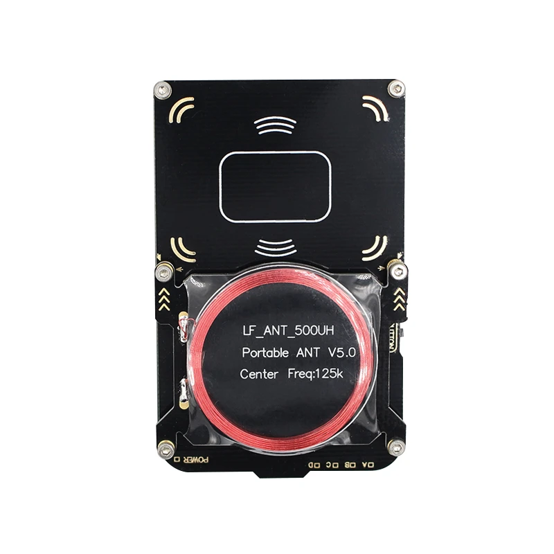

# Bambulab RFID Tag Hacking Guide

<!--ts-->
<!--te-->

## Before you start

This guide gives you a basic overview how you can encrypt your tags. Since we don't know how Bambulab will react on this guide and the general reverse engineering of the tags: **Please don't share you tag's UID and the related keys for now.**

## Todos/Timeline/Next steps

## Required Epuipment

- Bambulab 3D Printer with AMS
- Bambulab Filament spool **or** the related tags
- A proxmark3 compatible rfid reader
- proxmark3 installed on your computer

### Proxmark3 compatible readers

#### Proxmark3 easy

A Proxmark 3 easy is sufficent for all the tasks that need to be done. You can buy a clone from alixepress, amazon or dangerous things.

## Hacking a Bambulab Tag and readout of it's data
We document here the most simple approach to get all required A-Keys and the data of the tag.
The easiest way is to sniff the data

### Bambulab AMS RFID readers and sniffing
The Bambulab AMS RFID readers are locate between slot 1&2 and slot 3&4

For sniffing you can place a bambulab spool in slot 1 and place the reader next to the AMS reader.
If you have already a single tag you need to place a spool **without a tag** in slot one and tape a tag on the top side of the reader and hold the proxmark3 next to the reader in such a way that the proxmark3 reader's bottom side is directed to the AMS reader so the proxmark3 reader is between the tag and the AMS reader. It is recommended to rotate the proxmark3 reader similar to the spool. Details can be found in the next steps.

### Sniffing the data

To start the sniffing connect your rfid reader and open your proxmark3. 
Start sniffing with:

`hf 14a sniff -c -r`

Hold no the proxmark3 reader next to the AMS reader and load the filament or if already loaded the update icon on the screen.

When you are done you can press the button on the rfid-reader to stop the trace. To visualize the trace you just enter:

`trace list -t mf`

You should be able to see already first keys. Until you see a message :
"Nested authentication detected." with some bruteforce command: `tools/mf_nonce_brute/mf_nonce_brute <parameters>`

Execute this command in the proxmark3 directory in an other terminal and write down or save the found key.

Check the date for crc errors and if it's fine save the trace with the following command.

`trace save -f <trace-name>`

You can record now all your tags. If you want to load the traces later

`trace load -f <trace-name>`

To view the loaded trace just enter the following command.

`trace list -1 -t <trace-name>`

If you are using traces in the next steps you need to add the `-1` option when you analyze the traces.

### Getting the other keys by analyzing the log file

Remove now the spool/tag from the printer and place it on the reader so we can check all the keys.

Now a dictonary (*.dic) file with all the already found and bruteforced keys must be created.

Enter the keys line by line into that file.

The next steps need to be repeated until you have all keys. (A scirpt for this is already WIP)

1. `trace list -t mf -f <dic_file>`
2. bruteforce the new keys with the displayed command in a seperate terminal and add all new keys to the dict file
3. verify the keys: `hf mf fchk --1k -f <dic_file>`
4. Go to 1 until you found all keys

## Data Readout

Before the data can be read we need to generate a key file

`hf mf fchk --1k -f <dic_file> --dump`

The output is a binary key file: `hf-mf-<TAG UID>-key.bin`

Dump now the data:

`hf mf dump --1k --keys hf-mf-<TAG UID>-key.bin`

This can be viewed now in a hex or binary editor or you can view it with:

`hf mf view -f hf-mf-<TAG UID>-dump.bin`

## Generate Keys based on random UID

**TODO**

## Compatible RFID tags -  By generation

Gen 1 --> **Not compatible**(due to AMS checking if tag is unlockable with command 0x40)

Gen 2 --> **Not tested**

Gen 2 OTW --> **Not tested**

Gen 3 --> **Not tested**

Gen 4 --> **Not tested**(The best option but pricey and hard to source in small chip formfactor)
